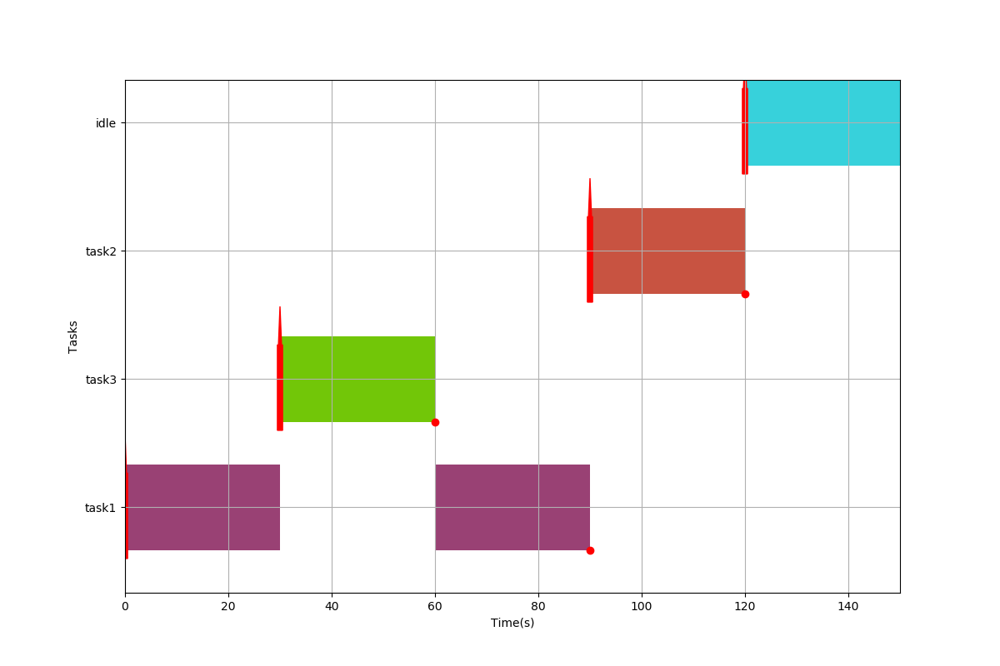

[![Contributors][contributors-shield]][contributors-url]
[![Forks][forks-shield]][forks-url]
[![Stargazers][stars-shield]][stars-url]
[![Issues][issues-shield]][issues-url]
[![MIT License][license-shield]][license-url]
[![LinkedIn][linkedin-shield]][linkedin-url]

<p align="center">
    <!--- relative path means image/image.png instead of https://etc... -->
                               
</a>

  <h3 align="center">Gantt Generator for TrampolineRTOS</h3>

  <p align="center">
    Generating GANTT scheduling diagrams from Trampoline's tracebacks
    <br />
    <a href="https://github.com/Guilyx/gantt-trampoline/blob/master/README.md"><strong>Explore the docs »</strong></a>
    <br />
    <br />
    <a href="https://github.com/guilyx/gantt-trampoline">View Demo</a>
    ·
    <a href="https://github.com/guilyx/gantt-trampoline/issues">Report Bug</a>
    ·
    <a href="https://github.com/guilyx/gantt-trampoline/issues">Request Feature</a>
  </p>
</p>

## Table of Contents

* [About the Project](#about-the-project)
* [Setup](#setup)
* [Run](#run)
* [Roadmap](#roadmap)
* [Contribute](#contribute)
* [License](#license)
* [Contact](#contact)
* [Contributors](#contributors)

## About the Project

[TrampolineRTOS](https://github.com/TrampolineRTOS/trampoline) is a RTOS built by academia in Nantes, France. Every RT applications you built leaves a trace with the tasks and events states at time t. The goal is to generate Gantt Plots from this trace.

## Setup

1. (Optional) Click on `Fork`
2. Clone the project on your local machine : `git clone https://github.com/guilyx/gantt-trampoline.git`
3. Install dependencies : 
  - Clone Trampoline
    ```shell
    $ git clone https://github.com/TrampolineRTOS/trampoline.git
    $ git checkout -b trace origin/trace
    ```
  - Goil 
    ```shell
    $ cd trampoline/goil/makefile-unix
    $ ./build/release.py
    $ sudo cp goil /usr/local/bin
    ```
  - Viper
    ```shell
    $ cd ../../viper
    $ make
    $ export VIPER_PATH=/opt/trampoline/viper
    $ echo 'export VIPER_PATH=/opt/trampoline/viper' >> ~/.bashrc
    note : if you use zsh replace bashrc by zshrc
    ```
  - Installing TrampolineRTOS
    ```shell
    $ sudo mv trampoline /opt
    note : assuming you are in the directory containing trampoline
    ```
4. Testing :
  ```shell
  $ git clone https://github.com/TrampolineRTOS/Labs.git
  $ cd Labs/posix/labs/lab1
  $ goil --target=posix --templates=/opt/trampoline/goil/templates/ lab1.oil
  ...
  No warning, no error.
  $ ./make.py
  ...
  [100%] Linking lab1_exe
  $ ./lab1_exe
  Hello World
  ```

Note : The TrampolineRTOS posix installation steps were written by [Mikael Briday](https://github.com/mbriday)

If you arrived to the last step with the `Hello World` output, your installation is ready. (Press `q`  to quit the application, `ctrl+c` is not handled.)


5. Install python dependencies with `pip install -r requirements.txt` from the repository's directory.

## Run

```shell
$ python main.py -h
usage: main.py [-h] [--tpl_path TPL_PATH] [--trace_path TRACE_PATH] use_trace

Generate Gantt Diagrams from Real-Time process' traces.

positional arguments:
  use_trace             0 to build from scratch, 1 to use processes' trace

optional arguments:
  -h, --help            show this help message and exit
  --tpl_path TPL_PATH   Register the path to the tpl static info json file
  --trace_path TRACE_PATH
                        Register the path to the trace json file
```

1. Run using a Trace of tasks : `python main.py 1 --tpl_path TPL_PATH --trace_path TRACE_PATH` (by default the paths goes to generated files in data/)
2. Run using your set of tasks : `python main.py 0`

## Roadmap

See the [open issues](https://github.com/guilyx/gantt-trampoline/issues) for a list of proposed features (and known issues).

## Contribute

Contributions are what make the open source community such an amazing place to learn, inspire, and create. Any contributions you make are **greatly appreciated**.

### Contribute on proposed features

1. Choose any open issue from [here](https://github.com/guilyx/gantt-trampoline/issues). 
2. Comment on the issue: `Can I work on this?` and get assigned.
3. Make changes to your `Fork` and send a PR.

Otherwise just create the issue yourself, and we'll discuss and assign you to it if serves the project !

To create a PR:

Follow the given link to make a successful and valid PR: https://help.github.com/articles/creating-a-pull-request/

To send a PR, follow these rules carefully, **otherwise your PR will be closed**:

1. Make PR title in this formats: 
```
Fixes #IssueNo : Name of Issue
``` 
```
Feature #IssueNo : Name of Issue
```
```
Enhancement #IssueNo : Name of Issue
```

According to what type of issue you believe it is.

For any doubts related to the issues, i.e., to understand the issue better etc, comment down your queries on the respective issue.

## License

Distributed under the MIT License. See `LICENSE` for more information.

## Contact

Erwin Lejeune - [@spida_rwin](https://twitter.com/spida_rwin) - erwin.lejeune15@gmail.com

## Contributors

- [Erwin Lejeune](https://github.com/Guilyx)

[contributors-shield]: https://img.shields.io/github/contributors/guilyx/gantt-trampoline.svg?style=flat-square
[contributors-url]: https://github.com/guilyx/gantt-trampoline/graphs/contributors
[forks-shield]: https://img.shields.io/github/forks/guilyx/gantt-trampoline.svg?style=flat-square
[forks-url]: https://github.com/guilyx/gantt-trampoline/network/members
[stars-shield]: https://img.shields.io/github/stars/guilyx/gantt-trampoline.svg?style=flat-square
[stars-url]: https://github.com/guilyx/gantt-trampoline/stargazers
[issues-shield]: https://img.shields.io/github/issues/guilyx/gantt-trampoline.svg?style=flat-square
[issues-url]: https://github.com/guilyx/gantt-trampoline/issues
[license-shield]: https://img.shields.io/github/license/guilyx/gantt-trampoline.svg?style=flat-square
[license-url]: https://github.com/guilyx/gantt-trampoline/blob/master/LICENSE.md
[linkedin-shield]: https://img.shields.io/badge/-LinkedIn-black.svg?style=flat-square&logo=linkedin&colorB=555
[linkedin-url]: https://linkedin.com/in/erwinlejeune-lkn
